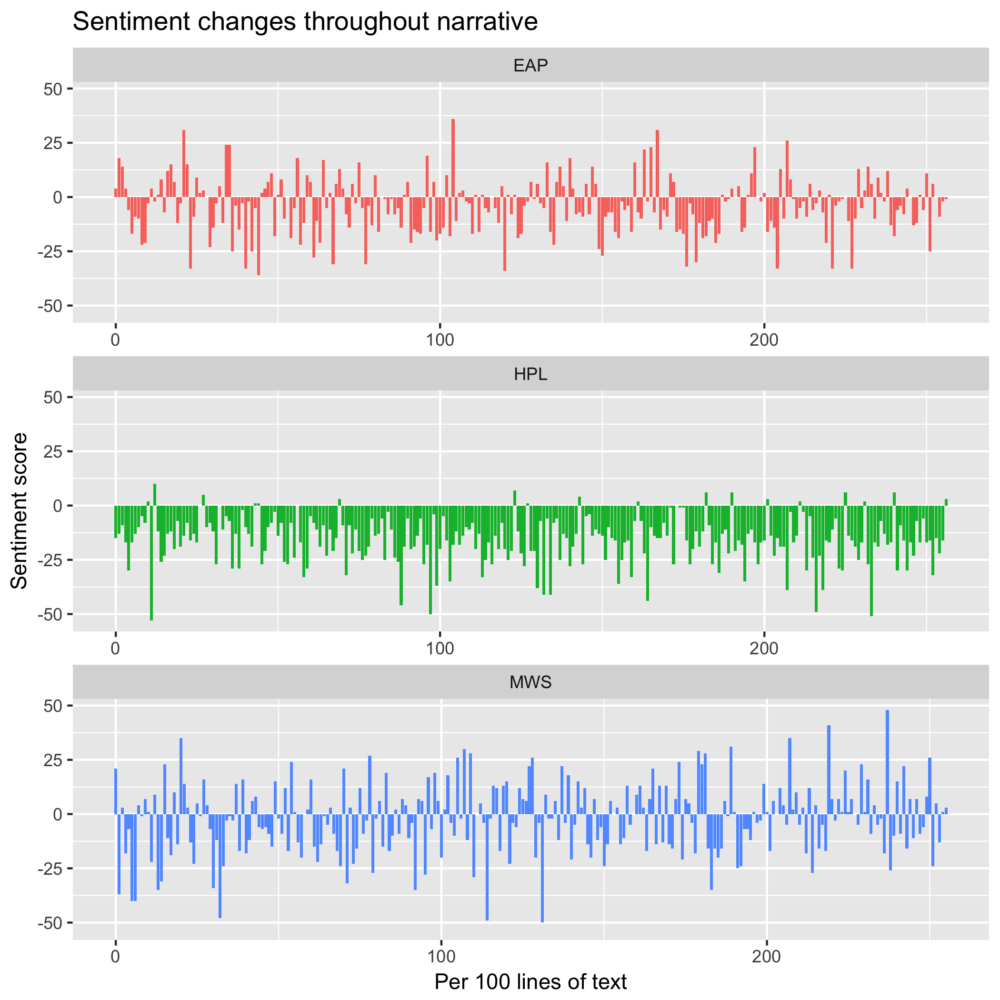
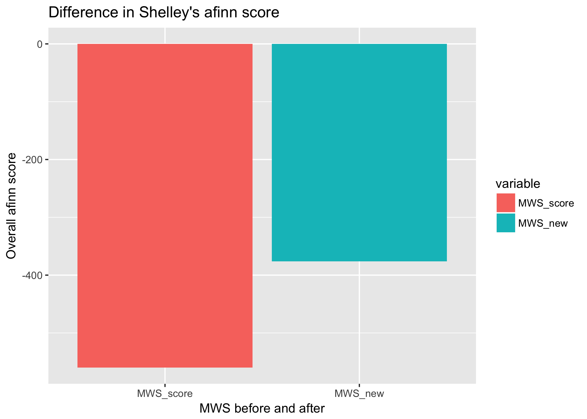

# Spooky Text Analysis: 
# 1st Place for spooky goes to Lovecraft (and more)
### A story of sentiment analysis 

Edgar Allan Poe, Mary Wollstonecraft Shelley, and H.P. Lovecraft are famous for their tales of mystery and horror. The files contain my investigation of the authors' texts using various text mining approaches, including sentiment analysis and character exploration. 

I began my spooky text study with an exploratory data analysis that analyzed sentence attributions and word frequencies. 

The three distinct and rather dissimilar patterns that emerged from the word frequency analysis prompted me to conduct sentiment analysis, in order to find out if these themes indeed map back to the entire narrative. 

Word-level analysis presented the overall sentiment scores as well as changes in sentiment throughout the trajectory of each author's narrative. Lovecraft's text champions negativity, which is heartily maintained throughout his entire narrative. Mary Shelley's text, while the most positive in nature, exhibits extremes, indicating greater fluctations between positive and negative moods, while Poe's is relatively stable. 

A bi-gram sentiment analysis was then performed to correct for the possibility of negating words making erroneous contributions to the sentiment score. For example, words preceded by negating words like "never" and "not" should be reversed to increase the sentiment score towards positivity. Indeed, the bigram analysis corrected the initial sentiment scores. What's more interesting to note is that the bigram analysis revealed more negativity in Lovecraft's text while making Poe's and Shelley's more positive. 

Finally, for my last chunk of analysis, I examined the role that gender may play in each author's text, by way of ratio of "significant" female and male characters, defined as those whose names are mentioned 20+ times in the text. Shelley's text had more "significant" female characters than male characters, while Poe and Lovecraft had very few if any "significant" female characters that were distinguishable based on name alone. 

The above results inspired me to further explore how Shelley's characters' development, roles, and personalities may differ based on gender. I chose Raymond and Perdita as subjects for this additional analysis; by isolating words that follow the mention of Raymond and Perdita's names, I deduced that Perdita may exhibit more subdued and docile tendencies than Raymond. 

